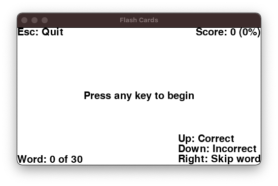
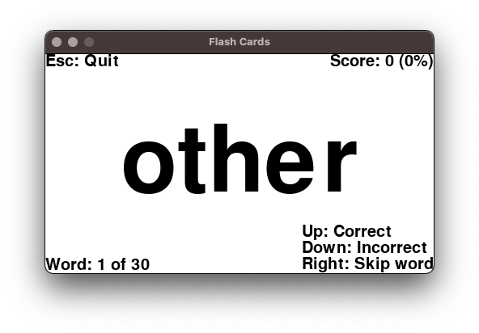

# sightright
SightRight is a training program for parents and teachers to use to train sight words with students and children.

## How to use

Written for Python 3. You'll need to have PyGame installed, so install that (if you haven't already).

`pip3 install pygame`

Then, first things first you need to import a word list. There is a starter word list in the repository that you can use.

`python3 sightright.py -i wordlist.csv`

After that, you can check to make sure the words have been imported.

`python3 sightright.py -l`

And, finally, run the program when you're ready to play with your student/child. The screen will come up and walk you through the rest of the operation.
The time is recorded for each answer, so that (in a future release) the program can point out words which are below average or above average. For this reason,
you'll have the best data if you promptly and accurately mark the answers as your child/student/charge is playing the game with you.
